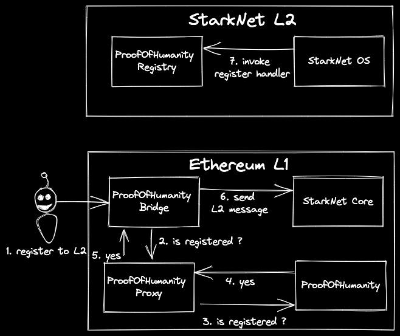

<div align="center">
  <h1 align="center">poh-starknet-bridge-l1</h1>
  <p align="center">
    <a href="https://github.com/abdelhamidbakhta">
        
    </a>
    <a href="https://twitter.com/intent/follow?screen_name=dimahledba">
        
    </a>       
  </p>
  <h3 align="center">Proof Of Humanity StarkNet bridge L1 smart contracts.</h3>
</div>

> ## ⚠️ WARNING! ⚠️
>
> This repo contains highly experimental code.
> Expect rapid iteration.
> **Use at your own risk.**

## 🏄‍♂️ Usage

### Flow



## Set up the project

### 📦 Install the requirements

- [foundry](https://book.getfoundry.sh/)

## ⛏️ Compile

```bash
forge build
```

## 🌡️ Test

```bash
forge test
```

## 📄 License

**poh-starknet-bridge-l1** is released under the [MIT](LICENSE).
